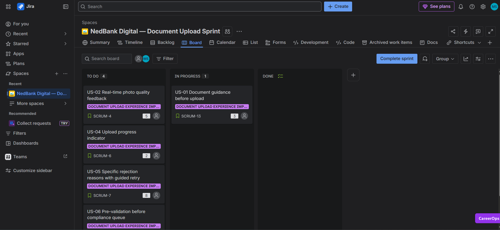

# 📋 Jira Sprint Board - Backlog & Execution Machine

## 🏃‍♂️ Moving from Paper to Production
A beautiful process map looks great on a slide deck, but until you break it down into actual developer tickets with point estimates and clear ownership, it’s just expensive wall art. The ultimate test of a Business Analyst isn't just diagnosing a problem-it’s handing an engineering team a backlog that reads with absolute clarity on Monday morning.

When Jira was introduced to software development teams back in 2002, it changed the game by forcing projects to switch from loose, ambiguous wishlists into structured, traceable execution cycles. 

That is exactly what this active sprint dashboard represents for our NedBank KYC initiative. This artifact bridges our optimized future-state workflow directly into active development, proving that our user stories are completely sprint-ready, estimated, and fully optimized for our cross-functional teams to hit the ground running.

---

### 🖼️ Sprint Board Interface

---

## ⚡ What's Inside This Sprint State
This board cuts out delivery confusion by structuring the initial 2-week optimization cycle into highly focused, traceable tracking columns:

*   **The Estimated Backlog:** Every single one of our 10 user stories has been broken out, fully written with Behavior-Driven Development (BDD) criteria, and assigned clear story points to match team capacity limits.
*   **The High-Value Focus:** Priorities are cleanly mapped to match our MoSCoW parameters—ensuring our "Must-Have" technical infrastructure elements (like camera integrations and the 4-point systemic pre-validation gates) take instant precedence.
*   **Traceable Alignment:** Every open engineering card maps right back to a diagnostic root-cause failure point, creating a single thread connecting business strategy to a developer's daily pull request.
