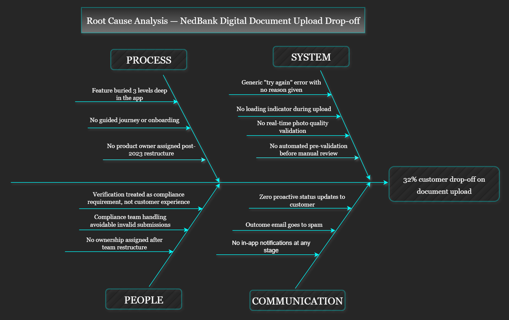

# 🏦 Agile BA Sprint Showcase - NedBank Digital

There is a lot of noise online about what a Business Analyst actually does. This repository cuts through that noise to showcase the exact, traceable footprint left behind when transforming a massive operational bottleneck into clean, developer-ready logic.

---

## 📉 The Friction Point
A mobile-first Dutch digital bank was watching one in three potential customers walk out the door during identity verification. The underlying infrastructure wasn't broken; the experience was. The upload journey had been copy-pasted directly from an old 2021 web design to mobile, left without an operational owner, and stripped of an active SLA. Instead of guiding users, the application fired a cold, generic error message that permanently scared away 65% of customer drop-offs.

This interactive portfolio documents how a cross-functional sprint team handles this chaos from initial forensic diagnostic to the final production-ready engineering backlog.

---

## 🔍 How This Was Built: The Root Cause

Every artifact presented in this repository corresponds directly to an active Agile sprint event, meaning nothing was created for its own sake. To prove that the bank's conversion bottleneck was a product governance gap rather than a technical failure, I conducted a deep **5 Whys Analysis** during Sprint 0 to map out the core systemic flaws.

### 🖼️ Root Cause Analysis (Fishbone Diagram)

---

## 🛠️ The Operational Artifact Showcase

### 📊 01 - Business Problem Statement

#### 📜 A Brief History of Writing Things Down (Before Building Them)
Long before the internet, ancient builders realized that starting a monument without counting the stones usually led to a very expensive pile of rubble. Somewhere around the industrial revolution, this survival instinct evolved into the "Business Case"- a formal way of asking, *"Are we throwing good money after a bad process?"* 

In the modern tech landscape, teams often skip this step entirely, adopting a philosophy of *"build it fast, fix it later."* But as it turns out, writing code without diagnosing the human friction behind it is just a very fast way to alienate a massive chunk of your user base. 

That is exactly why this document was authored on June 5, 2026. Before a single user story was prioritized or a Jira ticket created, we needed to stop guessing and state the cold, hard facts: our verification funnel was leaking. This artifact was created to anchor the entire sprint team to a commercial reality before anyone touched a line of code.

#### 📋 What This Artifact Proves:
*   **The Diagnostic (5 Whys):** A ruthless teardown that bypasses technical excuses to prove that our 32% drop-off rate was caused by a forgotten 2021 web design lazily migrated onto mobile devices without an assigned product owner.
*   **The Damage Report:** The raw financial cost of the friction-specifically, €2.1M in frozen premium product revenue, a €313K mountain of completely avoidable customer support tickets, and severe regulatory Wwft compliance exposure.
*   **The North Star:** Legally vetted target benchmarks like slashing drop-offs below 10% and compressing a 4.2-day manual compliance wait into a tight, under 24-hour turnaround window.

*📥 **Download the full business specification brief:** [NedBank Digital Business Statement.pdf](./01-business-problem-statement/NedBank%20Digital%20Business%20Statement.pdf)*

---

### 👥 02 - Stakeholder Register & Governance Framework

#### 👑 The Art of Herding Cats (And Avoiding Project Sabotage)
If you think of a high-friction corporate project as a high-stakes theatrical production, it becomes immediately clear that a script is useless if the actors are refusing to step onto the stage together. You can design the most flawless process in the world, but if you don't actively navigate the human egos, competing agendas, and hidden veto powers behind the scenes, your final curtain will drop long before your first deployment. 

In the tech industry, teams often treat a "Stakeholder Register" as a boring corporate directory of names and email addresses. But in reality, it is a risk mitigation map. If you treat a regulatory Compliance Officer like an afterthought, or keep your UX designer completely in the dark until user testing, you are actively inviting scope creep and last-minute architectural rejections. 

This governance framework was built during Sprint 0 to establish ironclad communication lanes early. It ensures that product, legal, and engineering actors are perfectly aligned on who owns what decision, removing political roadblocks long before the sprint backlog is committed.

#### 📋 What This Artifact Proves:
*   **The Power/Interest Matrix:** A strategic teardown partitioning our six core actors based on their organizational influence-ensuring we closely collaborate with heavy-hitters like Product and Compliance, while keeping Customer Service and Data Analytics efficiently informed.
*   **The Engagement Strategy:** A highly targeted playbook mapping individual motivations, ranging from our UX designer's need for compliance constraints upfront to our Backend Developer's insistence on pre-defined non-functional size and format limits.
*   **The Decision-Making RACI:** A clear blueprint defining exactly who is Responsible, Accountable, Consulted, and Informed across high-stakes sprint crossroads, ensuring our Compliance Officer has explicit sign-off authority on acceptance criteria before any development kicks off.

*📥 **Download the full stakeholder register specification:** [NedBank Digital Stakeholder Register.pdf](./02-stakeholder-register/NedBank%20Digital%20Stakeholder%20Register.pdf)*

---

### 🔴 03 - AS-IS Process Map

#### 🕵️‍♂️ The Art of Forensic Diagnosis (Mapping the Mess)
If you ask a broken system's users why things are failing, they will usually give you symptoms: *"The app is slow,"* or *"It just gave me an error."* But a great Business Analyst doesn't build solutions based on complaints; they look for the structural leaks. You have to map the current chaos exactly as it exists today, without sugarcoating the bottlenecks, to prove precisely where the money and the users are bleeding out.

In many corporate projects, teams draw an "AS-IS" map simply to check a box in the project lifecycle. In reality, it is a crime scene investigation. By tracking every systemic dead-end, missing loop, and manual handoff, you strip away the excuses of *"it has always worked this way."* 

#### 🖼️ Current State Friction Blueprint

#### 📋 What This Artifact Proves:
*   **The Hidden Gateway:** The entire identity verification feature is buried three levels deep under passive application menus, ensuring up to 38% of customers abandon the journey before it even begins.
*   **The Blind Upload:** Zero upfront visual guidance or formatting parameters are provided, forcing users to guess compliance needs and leading them to select incorrect document types.
*   **The Feedback Vacuum:** No active progress or loading indicators are presented during transmission, causing 9% of users to force-quit the application thinking the system has crashed.
*   **The Strategic Dead-End:** When a document fails validation, the system fires a generic "try again" rejection error with no context, forcing an immediate 65% churn rate.
*   **The Black Hole SLA:** Validated documents drop into a manual compliance review queue with zero automated filtering, inflating average customer processing times to a staggering 4.2 days.

*📥 **Download the master source modeling file (contains both tabs):** [NedBank_AS-IS TO-BE Process Map.drawio](./03-as-is-process/NedBank_AS-IS%20TO-BE%20Process%20Map.drawio)*

---

### 📋 04 - User Stories & Acceptance Criteria

#### 🏗️ Building Bridges (And Preventing Developer Mind-Reading)
Think of a complex software requirement like a blueprint for a modern bridge; you wouldn't hand a construction crew a napkin sketch that says *"make a crossing here"* and expect the structure to hold under pressure. Yet, asking an engineering team to code a high-stakes, compliance-egulated feature based on vague corporate bullet points happens every single day, with disastrous results. 

In many product teams, user stories are treated like a compliance chore shallow sentences scribbled down minutes before a sprint planning session. In reality, they are the vital translation layer between a business strategy and technical execution. A truly great user story removes the need for telepathy. It ensures that an engineer sitting down to write code on a Monday morning knows exactly what parameters constitute success, and a QA tester knows exactly how to validate the feature before it ever reaches a real customer.

#### 📋 What This Artifact Proves:
*   **Behavior-Driven Development (BDD) Framework:** Every requirement is rigorously defined using the clear *Given/When/Then* narrative pattern-explicitly mapping out hard engineering thresholds like 3-second system timeout responses and real-time photo blur detection limits.
*   **The MoSCoW Prioritisation Matrix:** A clear, strategic breakdown dividing our 10 user stories into non-negotiable core launch features (Must-Haves) and valuable down-funnel enhancements (Should and Could-Haves) to respect sprint capacity constraints.
*   **Cross-Functional Guardrails:** Embedded non-functional specs covering automated 4-point systemic pre-validation gates (format checks, resolution maximums, and document side validation) alongside deep real-time CRM tracking requirements.

*📥 **Download the full requirement specifications:** [NedBank Digital User Stories.pdf](./04-user-stories/NedBank%20Digital%20User%20Stories.pdf)*

---

### 💻 05 - Jira Sprint Board

#### 🏃‍♂️ Moving from Paper to Production
A beautiful process map looks great on a slide deck, but until you break it down into actual developer tickets with point estimates and clear ownership, it’s just expensive wall art. The ultimate test of a Business Analyst isn't just diagnosing a problem-it’s handing an engineering team a backlog that reads with absolute clarity on Monday morning.

When Jira was introduced to software development teams back in 2002, it changed the game by forcing projects to switch from loose, ambiguous wishlists into structured, traceable execution cycles. This board bridges our optimized future-state workflow directly into active development, proving that our user stories are completely sprint-ready, estimated, and fully optimized for our cross-functional teams to hit the ground running.

#### 🖼️ Active Sprint Backlog

#### 📋 What This Artifact Proves:
*   **The Estimated Backlog:** Every single one of our 10 user stories has been broken out, fully written with Behavior-Driven Development (BDD) criteria, and assigned clear story points to match team capacity limits.
*   **The High-Value Focus:** Priorities are cleanly mapped to match our MoSCoW parameters—ensuring our "Must-Have" technical infrastructure elements (like camera integrations and the 4-point systemic pre-validation gates) take instant precedence.
*   **Traceable Alignment:** Every open engineering card maps right back to a diagnostic root-cause failure point, creating a single thread connecting business strategy to a developer's daily pull request.

---

### 🟢 06 - TO-BE Process Map

#### 🚀 The Anatomy of a High-Conversion Funnel
Identifying a business bottleneck is only half the battle; the real mastery lies in architecting the structural escape route. This blueprint isn't an idealistic wish list-it is an engineering blueprint designed to ruthlessly eliminate friction, automate regulatory compliance, and drop onboarding churn below our 10% target.

By re-engineering the touchpoints across the Customer, System, and Compliance swimlanes, this future-state workflow systematically replaces dead-ends with intelligent self-correcting feedback loops. It transforms verification from an administrative barrier into a competitive product advantage.

#### 🖼️ Future State Optimization Blueprint

#### 📋 What This Artifact Proves:
*   **Zero-Tap Discovery:** Elevates the hidden feature into an immediate, high-visibility prompt directly on the user's home dashboard, completely neutralizing the legacy discovery friction.
*   **Visual Guardrails:** Deploys interactive thumbnail templates upfront, setting crystal-clear submission expectations before a camera lens is even opened.
*   **Edge-Side Validation:** Introduces live blur, glare, and scaling analysis right inside the camera interface, stopping low-quality uploads before they can hit our system servers.
*   **Smart Remediation:** Eradicates the ambiguous generic error message, replacing it with explicit, plain-English instructions and pre-filled guided retry buttons.
*   **The Compliance Sieve:** Introduces an automated 4-point programmatic gateway that automatically bounces invalid, corrupted, or incomplete files instantly.
*   **SLA Compression:** Funnels an exclusively valid, clean data stream into the manual review queue, driving verification turnaround times from a sluggish 4.2 days down to a rapid, under-24-hour window.

*📥 **Download the master source modeling file (contains both tabs):** [NedBank_AS-IS TO-BE Process Map.drawio](./06-to-be-process-map/NedBank_AS-IS%20TO-BE%20Process%20Map.drawio)*

---

## 🧰 Technical Tooling
*   **Process Modeling:** draw.io (BPMN 2.0 standard)
*   **Agile Management:** Jira Software & Confluence (Atlassian)
*   **Documentation Architecture:** Markdown Object Notation

---
*This initiative forms part of a broader Business Analysis portfolio. Other modules cover data governance frameworks anchored in public financial systems, ESG data quality auditing protocols, and predictive customer churn briefs.*
